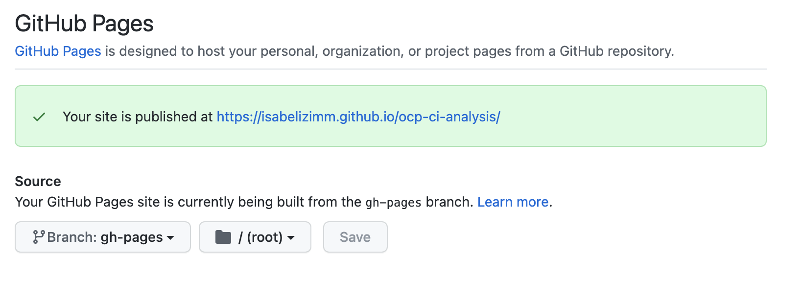

# Set up Jupyter Book from a Git Repository

1. Add [_config.yml](./_config.yml) to the root of the repo
    - Update `title:` and `author:` fields in _config.yaml
2. Add [_toc.yml](./_toc.yml) to the root of the repo
    - Update `caption:` and `chapters:` fields with the path of each file you want to include on the navigation panel.
3. Run `pip install -U jupyter-book` in cli interface
4. `jupyter-book build <repo_name> .` (this creates all necessary Jupyter Book files and stores them in `_build/html`)

At this point, you have created your Jupyter Book! The next steps are to publish your book as a GitHub pages site on GitHub. Note: to use your repo within the Meteor project, only steps 1 and 2 are necessary.

## Publish on GitHub pages

1. Run `pip install ghp-import` in cli interface
2. Delete the `_build/html/_sources` as these are just copies of the repo files that were converted to html. (optional)
3. Add `_build` folder to `.gitignore` so that its files are not tracked while pushing to master. (optional)
4. Run `ghp-import -n -p -f _build/html`
5. Build site by going to repo settings-->pages and set source to branch:gh-pages and directory:root/

Within a few minutes, you should see your GitHub pages environment populate with your JupyterBook content.
